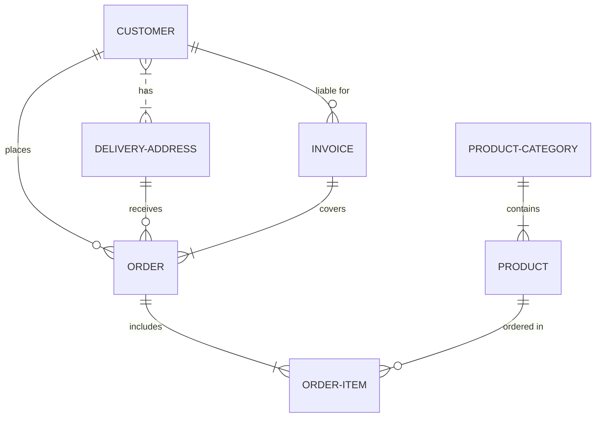

# Proyecto de Estudio!
    
**Estructura del documento principal:**

# Gestor de mantenimiento

**Asignatura**: Bases de Datos I (FaCENA-UNNE)

**Integrantes**:
 - Jorge Ramón Montiel Nuñez
 - Francisco Daniel Segovia
 - Alexis Toledo
 - Renata Villalba Ruiz Diaz
   
**Año**: 2025

## CAPÍTULO I: INTRODUCCIÓN

### Caso de estudio

En este proyecto se desarrollará una base de datos orientada a la gestión del mantenimiento de maquinaria, con especial énfasis en la organización de tareas por parte de grupos de técnicos y en el control de los costos asociados. El sistema debe contemplar actividades clave como el registro de máquinas, la planificación de revisiones, la ejecución de reparaciones, la administración de repuestos y la asignación del personal técnico.

A través de esta base de datos se busca no solo almacenar la información operativa, sino también gestionarla de forma eficiente, asegurando trazabilidad de las intervenciones realizadas y control sobre los costos de repuestos y reparaciones. El objetivo es mejorar la planificación, reducir errores administrativos y optimizar la toma de decisiones sobre el mantenimiento preventivo y correctivo.

### Definición o planteamiento del problema

Actualmente, la gestión de mantenimiento de maquinaria presenta diversas limitaciones debido a que la información se maneja en registros dispersos y, en muchos casos, de forma manual. Esto provoca una serie de inconvenientes, entre los que se destacan la falta de control en los costos asociados a reparaciones y repuestos, la dificultad para organizar los grupos de técnicos y asignarles tareas específicas, y la ausencia de un historial centralizado de revisiones y diagnósticos de cada máquina. A esto se suman los riesgos de pérdida de información vinculada a la disponibilidad y ubicación de las instalaciones, así como la escasa trazabilidad en los procesos de reparación, lo cual repercute de manera directa en la eficiencia operativa. Todas estas deficiencias impactan negativamente en la productividad de la empresa, generando gastos innecesarios y limitando la capacidad de planificación.

### Alcance

- Registro de máquinas con información de modelo, matrícula, marca e instalación correspondiente.

- Gestión de revisiones de maquinaria: fechas, diagnósticos asociados, grupos técnicos responsables y vinculación con reparaciones posteriores.

- Administración de reparaciones: fechas de inicio y fin, repuestos utilizados, costos asociados y grupos asignados (de ser necesaria una reparación).

- Registro de repuestos vinculados a cada máquina al realizar una reparación, incluyendo descripción y costo.

- Control de grupos de técnicos: cantidad de integrantes y distribución de tareas.

- Gestión de técnicos: datos personales, grupo asignado y disponibilidad.

- Registro de instalaciones con datos de contacto y teléfonos asociados.

### Limitaciones

- No se incluye registro avanzado de rentabilidad o presupuestos anuales de mantenimiento.

- No se contemplan métricas de desempeño individual de técnicos ni equipos de trabajo.

- No se contempla la gestión de proveedores externos de repuestos o servicios.

- No se implementa un sistema automatizado de compras para reposición de stock de repuestos.

## Ojetivos del Trabajo Práctico

### Objetivos Generales

- Analizar las necesidades de gestión de mantenimiento de maquinaria, con foco en el control de costos y la organización técnica.

- Diseñar una base de datos que integre la información de máquinas, técnicos, repuestos, revisiones, diagnósticos y reparaciones.

- Brindar una solución que permita mejorar la eficiencia operativa y la trazabilidad de las intervenciones realizadas.

- Cumplimentar la investigación de los temas obligatorios proporcionados.

## Objetivos Específicos

- Diseñar un modelo de datos que represente de manera clara las relaciones entre las entidades principales: máquinas, instalaciones, revisiones, diagnósticos, reparaciones, repuestos, técnicos y grupos.

- Implementar un sistema que permita registrar y consultar costos asociados a repuestos y reparaciones.

- Evaluar la eficacia del sistema en la reducción de errores administrativos y en la mejora de la planificación del mantenimiento.

- Aplicar técnicas de bases de datos relacionales para garantizar integridad, consistencia y seguridad de la información.

- Facilitar la trazabilidad histórica de cada máquina, contemplando diagnósticos, revisiones y reparaciones realizadas.

- Mejorar la asignación de tareas a grupos de técnicos, optimizando la distribución de recursos humanos.

## CAPITULO II: MARCO CONCEPTUAL O REFERENCIAL

**TEMA 1 " ---- "** 
Ut sed imperdiet risus. Maecenas vestibulum arcu vitae orci pretium pharetra. Suspendisse potenti. Fusce massa libero, fermentum eget elit in, tincidunt fermentum nunc. Cras imperdiet nisl elit, elementum gravida enim accumsan vel. Sed in sapien quis ante consectetur commodo id non nulla. Aenean lacinia, dolor convallis semper mattis, ante orci elementum nunc, eget feugiat risus neque in urna. Ut ut quam nec risus mollis convallis ornare ac odio. Phasellus efficitur posuere nibh, eget tempor augue pellentesque ac. Ut enim sem, imperdiet non est ut, blandit posuere dui. Curabitur at purus orci. Interdum et malesuada fames ac ante ipsum primis in faucibus.

**TEMA 2 " ----- "** 
Ut sed imperdiet risus. Maecenas vestibulum arcu vitae orci pretium pharetra. Suspendisse potenti. Fusce massa libero, fermentum eget elit in, tincidunt fermentum nunc. Cras imperdiet nisl elit, elementum gravida enim accumsan vel. Sed in sapien quis ante consectetur commodo id non nulla. Aenean lacinia, dolor convallis semper mattis, ante orci elementum nunc, eget feugiat risus neque in urna. Ut ut quam nec risus mollis convallis ornare ac odio. Phasellus efficitur posuere nibh, eget tempor augue pellentesque ac. Ut enim sem, imperdiet non est ut, blandit posuere dui. Curabitur at purus orci. Interdum et malesuada fames ac ante ipsum primis in faucibus.

...

## CAPÍTULO III: METODOLOGÍA SEGUIDA 

Donec lobortis tincidunt erat, non egestas mi volutpat in. Cras ante purus, luctus sed fringilla non, ullamcorper at eros.

 **a) Cómo se realizó el Trabajo Práctico**
Vestibulum rutrum feugiat molestie. Nunc id varius augue. Ut augue mauris, venenatis et lacus ut, mattis blandit urna. Fusce lobortis, quam non vehicula scelerisque, nisi enim ultrices diam, ac tristique libero ex nec orci.

 **b) Herramientas (Instrumentos y procedimientos)**
Donec lobortis tincidunt erat, non egestas mi volutpat in. Cras ante purus, luctus sed fringilla non, ullamcorper at eros. Integer interdum id orci id rutrum. Curabitur facilisis lorem sed metus interdum accumsan. 

## CAPÍTULO IV: DESARROLLO DEL TEMA / PRESENTACIÓN DE RESULTADOS 

Maecenas molestie lacus tincidunt, placerat dolor et, ullamcorper erat. Mauris tortor nisl, ultricies ac scelerisque nec, feugiat in nibh. Pellentesque interdum aliquam magna sit amet rutrum. 

### Diagrama conceptual (opcional)
Ejemplo usando Live Editor https://mermaid.js.org/ (ejemplo opcional)

### Diagrama relacional

### Diccionario de datos

Acceso al documento [PDF](doc/diccionario_datos.pdf) del diccionario de datos.

### Desarrollo TEMA 1 "----"

Fusce auctor finibus lectus, in aliquam orci fermentum id. Fusce sagittis lacus ante, et sodales eros porta interdum. Donec sed lacus et eros condimentum posuere. 

> Acceder a la siguiente carpeta para la descripción completa del tema [scripts-> tema_1](script/tema01_nombre_tema)

### Desarrollo TEMA 2 "----"

Proin aliquet mauris id ex venenatis, eget fermentum lectus malesuada. Maecenas a purus arcu. Etiam pellentesque tempor dictum. 

> Acceder a la siguiente carpeta para la descripción completa del tema [scripts-> tema_2](script/tema02_nombre_tema)

... 

## CAPÍTULO V: CONCLUSIONES

Nunc sollicitudin purus quis ante sodales luctus. Proin a scelerisque libero, vitae pharetra lacus. Nunc finibus, tellus et dictum semper, nisi sem accumsan ligula, et euismod quam ex a tellus. 

## BIBLIOGRAFÍA DE CONSULTA

 1. List item
 2. List item
 3. List item
 4. List item
 5. List item

